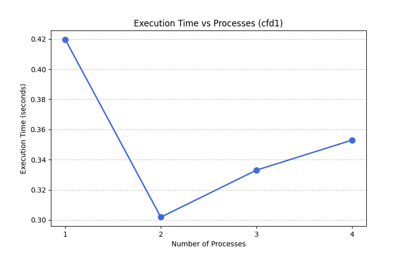
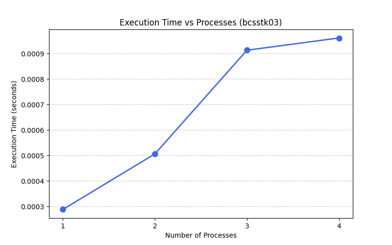
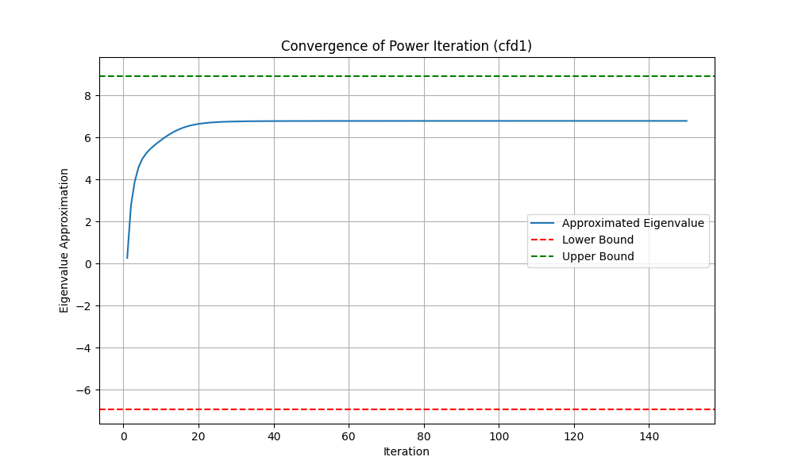
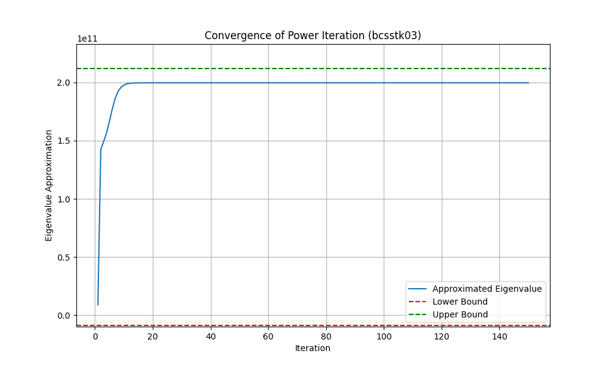

# Serial vs Distributed performance
We notice that execution time increases with more processe, except for cfd1 which improves at 2 processes. This suggests that parallelism is only beneficial for sufficiently large problems (cfd1), and small tasks (bcsstk03) suffer from overheads.

## Time Plots

The following results were obtained on a i5-6200U with two cores and 4 threads.
### CFD1 Time Plot

### BCSSTK03 Time Plot

# Convergence plots
Below are two plots representing the evolution of the approximated spectral radius over time. With bounds obtained by Gershgorin method being highlighted to prove the correctness of the method.

The number of proccesses has no influence on the convergence rate of the function. However, the size of the matrix seems to have an effect, since bcsstk03 needs half as many iterations as cf1 to converge, so it seems that the smaller the matrix, the less iterations it takes to converge.

## CFD1 Convergence Plot

## BCSSTK03 Convergence Plot
